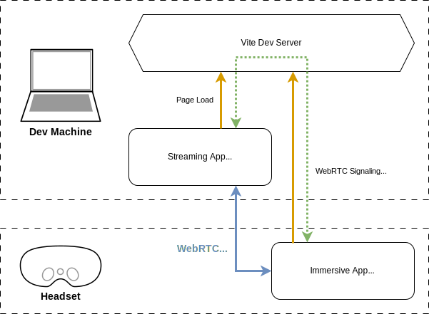

# Hot Reload the Metaverse

The web platform is a compelling choice for immersive XR development. The WebXR
API is mature enough to build great experiences, and deliver them to users
quickly and without gatekeepers.

One benefit of using web technologies is rapid iteration times. From the early
days of "live reload" to modern state-preserving "hot module replacement," it's
long been the norm to modify a web page or app while it's running and quickly
see the results. These tools offer a solution to one of the pain points of XR
development, where the iteration cycle is usually slowed by having to code
outside of your immersive experience, often with the headset removed, requiring
cumbersome donning and doffing for every tweak.

If you're iterating on non-interactive parts of the experience, like graphics or
audio, then you can work against a flat projection of the scene, maybe using the
Chromium WebXR emulator dev tool. If your headset produces clear enough text to
work with, you can also use a remote display or remote desktop app to keep the
headset on. You'll still encounter friction when working on interactive
behaviors, like gestures, that require you to actually enter the immersive
session, test the change, and exit back to your remote display app; with my
Quest Pro and Meta's browser, this cycle still takes several seconds, jarringly
blanking out the display during the transition.

There is a faster way. React Three Fiber with a dev server like Vite already
enables hot reload workflows for non-immersive WebGL projects, and React XR
builds on top of it for easier use with the WebXR API.

The only remaining obstacle is not being able to see your dev machine's display
inside the WebXR session. It turns out this is a pretty simple challenge to
overcome, with about 200 lines of code leveraging our existing dev server and
the WebRTC API — the same one that lets you share your desktop in video calls,
like with Google Meet.

This repository demonstrates a very simple setup, using Vite and React XR, to
bring your display into the WebXR session, and enable truly fast iteration.

### The Setup

I'm using a Meta Quest Pro, developing on a Macbook Pro, using React XR/React
Three Fiber and Vite.

The techniques used here can be adapted to other toolchains, as long as you can
get a non-immersive WebGL hot module setup working.

The dev machine will run the Vite dev server, which will serve two different
pages.

`index.html` renders the immersive experience you're developing with React XR.
It will be loaded by the headset's browser.

`stream.html` captures the dev machine's desktop video stream to send to the
immersive app.

Effectively, there are two JavaScript apps, one running on the headset and one
running on the dev machine. Both are served by the Vite dev server, which is
configured with a custom plugin that will pass messages between them using
Vite's built in HMR websocket connection.

The messages will establish a WebRTC connection between the two apps, streaming
the desktop video of the dev machine into a `<video />` element in the immersive
app.

The immersive app will then render the contents of the video inside the WebXR
session, using WebXR Layers for the best possible quality. It includes
additional logic to ensure the `RemoteDisplay` layer renders at the proper depth
in the scene.

This project includes a simple 3D scene to provide some context when
demonstrating the result.

The key files implementing the remote display logic are:

- `vite.config.ts`, where message passing is configured
- `stream.html`, a single-file JavaScript app loaded by the dev machine
- `connectToRemoteDisplay.ts`, logic on the immersive app side for connecting to
  the WebRTC stream
- `RemoteDisplay.tsx`, a React component rendering the display in the WebXR
  session

### Configuring Vite

We need our Vite config to serve both of our browser apps over https and forward
messages between them. The WebXR and WebRTC APIs we need to use only work in a
secure context, so https is required, configured with the `server` rule and
`@vitejs/plugin-basic-ssl`. By default Vite only serves a single `index.html`
page, but it's easy to add another with `build.rollupOptions.input`:

https://github.com/gregfagan/blog/blob/e60733f481e9e3a3e00b016c2ab0d1e13cf45faa/xr-remote-display/vite.config.ts#L1-L17

Message passing is easily implemented with a custom plugin, which I've added to
the config itself due to its simplicity. `configureServer` gives us a hook into
the websocket that Vite uses for hot module replacement.

https://github.com/gregfagan/blog/blob/e60733f481e9e3a3e00b016c2ab0d1e13cf45faa/xr-remote-display/vite.config.ts#L19-L38

The plugin simply forwards arbitrary JSON blobs between the two apps. We give
names to a few specific events we'll need when setting up the WebRTC connection.
See the [Vite Plugin API](https://vitejs.dev/guide/api-plugin.html) for more
information.

### Streaming App

Next let's look at the app that will run in a browser on the dev machine. It's
goal is to grab the desktop video and initiate the WebRTC connection. It's a
simple enough app that I've implemented it entirely in the HTML document.

https://github.com/gregfagan/blog/blob/612e986dac3ca9d3e1663c7fbb49db882f4b5f1d/xr-remote-display/stream.html#L1-L6

The only element on the page is a button to initiate the connection. Usually,
that action will be triggered when the immersive app loads and sends this one an
`rtc:connect` message, but occasionally we'll need to do it manually. Either
way, the first time it happens on each page load, we'll have to click through
the browser's video streaming permissions dialog.

https://github.com/gregfagan/blog/blob/612e986dac3ca9d3e1663c7fbb49db882f4b5f1d/xr-remote-display/stream.html#L7-L9

The script begins by defining two references. The first, `ws`, is an alias for
Vite's HMR API, at `import.meta.hot`. This API is made available by a script
that Vite appends to the page when serving it in development mode.

Normally you'd use this API for custom handling of HMR events, but in our case
we're just taking advantage of the fact that it's the websocket connection that
our Vite plugin uses; for this reason it's renamed `ws`.

The second reference will be to the desktop video `MediaStream`. The mutable
reference will be initialized only the first time the `connect` function is
called, so that reconnection events can happen without having to click through
the permissions dialog again.

https://github.com/gregfagan/blog/blob/612e986dac3ca9d3e1663c7fbb49db882f4b5f1d/xr-remote-display/stream.html#L11-L16

After obtaining the MediaStream, we'll set up the WebRTC connection. WebRTC can
be quite complex, but this use case is very simple and because both the headset
and dev machine are connected to the dev server, we can skip the usual hurdle of
having the two peers discover each other.

The connection is established by passing primarily two types of messages:

1. Session Description Protocol (SDP offer/answer)
2. Interactive Connectivity Establishment (ICE)

The SDP messages communicate media information, like what streams and codecs
will be used. The ICE messages allow the peers to negotiate the lowest latency
connection over the network. In our case both peers should be on the same local
network, and latency will mostly not be an issue. You can read more about
[WebRTC on MDN](https://developer.mozilla.org/en-US/docs/Web/API/WebRTC_API/Signaling_and_video_calling).

The first thing to do is create the `RTCPeerConnection` object and hook it up to
the `MediaStream`.

https://github.com/gregfagan/blog/blob/612e986dac3ca9d3e1663c7fbb49db882f4b5f1d/xr-remote-display/stream.html#L18-L19

Now we'll create and send the SDP offer, and add a message listener for the SDP
answer.

https://github.com/gregfagan/blog/blob/612e986dac3ca9d3e1663c7fbb49db882f4b5f1d/xr-remote-display/stream.html#L21-L30

The last thing to do in our `connect` function is handle ICE messaging by
listening to the messages coming from our own peer connection, sending them over
to the immersive app, and listening for its ICE messages.

https://github.com/gregfagan/blog/blob/612e986dac3ca9d3e1663c7fbb49db882f4b5f1d/xr-remote-display/stream.html#L32-L41

Finally, we hook up the two events that can trigger the whole process – either
the `rtc:connect` message from the immersive app, or a click on our button.

https://github.com/gregfagan/blog/blob/612e986dac3ca9d3e1663c7fbb49db882f4b5f1d/xr-remote-display/stream.html#L43-L48

### Immersive App: WebRTC

The next task is to receive the desktop video stream in the immersive app and
display it in a standard `<video />` element.

https://github.com/gregfagan/blog/blob/2de71eac7d96d4e4f511d29cccfbfd465a205816/xr-remote-display/src/connectRemoteDisplay.ts#L1-L11

Like the streaming app, we grab a reference to the websocket API. Our equivalent
to the input `stream` is an output `video`. To keep the demonstration concise,
this `video` element is created through the standard DOM API and exported from
the module; we'll need the reference to it later to render in WebXR.

It's configured to autoplay, and some style rules to keep it in the document but
invisible. Tweak these to verify it's working.

Also like the streaming app, we have a `connect` function. It's called when the
app initializes over in `main.tsx`:

https://github.com/gregfagan/blog/blob/93830f94052a28d35cdf17e79b1d5cadde9b1448/xr-remote-display/src/main.tsx#L6-L8

In `connect`, we receive the offer from the streaming app and send an answer:

https://github.com/gregfagan/blog/blob/025ad68cba378194a45cf805f0b5bcda18c4af0a/xr-remote-display/src/connectRemoteDisplay.ts#L13-L21

...and send/receive ICE candidates:

https://github.com/gregfagan/blog/blob/025ad68cba378194a45cf805f0b5bcda18c4af0a/xr-remote-display/src/connectRemoteDisplay.ts#L23-L29

Once the connection is established, our `RTCPeerConnection` will emit a `track`
event with the remote desktop video stream.

https://github.com/gregfagan/blog/blob/025ad68cba378194a45cf805f0b5bcda18c4af0a/xr-remote-display/src/connectRemoteDisplay.ts#L31-L37

With all of our event handlers established, we send the `rtc:connect` event over
to the streaming app, kicking off the connection process (or reconnecting, if we
had to reload the page).

https://github.com/gregfagan/blog/blob/025ad68cba378194a45cf805f0b5bcda18c4af0a/xr-remote-display/src/connectRemoteDisplay.ts#L39-L40

### Immersive App: WebXR

With remote desktop video streaming implemented in ~130 lines of code, all
that's left is rendering the result in our WebXR session.

The display technology of my Quest Pro is pretty impressive, but still quite a
bit short of what physical monitors are capable of. For comfortable ergonomics,
I project my 16" Macbook Pro onto a curved screen, a bit over a meter in front
of me, and covering a large field of view. It's comparable to Meta's remote
display app or Horizon Workrooms.

Since we're leveraging ThreeJS through React Three Fiber and ReactXR, the most
straightforward approach is to use `CylinderGeometry` with a `VideoTexture`.
This works, and I use it as a fallback when the WebXR session isn't available,
but there's a better way.

The WebXR API includes a system of layers, which are specialized geometry for
compositing media or infrequently updating textures that the headset can render
and reproject without the performance burden of the JavaScript application
having to produce the pixels every frame.

Using a WebXR cylinder media layer, we not only minimize the framerate cost of
our remote display, but gain clarity as well: the compositor can directly read
and render the video buffer, rather than sampling a copy of it from a userland
texture.

This API is used from a `RemoteDisplay` React component.

https://github.com/gregfagan/blog/blob/e495bda82efc915045feffd34b8ed8a7516947bb/xr-remote-display/src/RemoteDisplay.tsx#L13-L21

After the module imports, the component is defined with a few props related to
the cylinder geometry. The
[WebXR cylinder layer](https://www.w3.org/TR/webxrlayers-1/#xrcylinderayertype)
is well defined, and it's pretty easy to map over to the ThreeJS
`CylinderGeometry` that we'll use later. Tweak these values to find a
comfortable size and location for the display.

https://github.com/gregfagan/blog/blob/e495bda82efc915045feffd34b8ed8a7516947bb/xr-remote-display/src/RemoteDisplay.tsx#L22-L27

The initial block of hooks is dedicated to the construction of the layer.
`createLayer` is defined after the component; it uses the video exported from
`connectRemoteDisplay.ts` module to add the media layer to the WebXR session.

https://github.com/gregfagan/blog/blob/e495bda82efc915045feffd34b8ed8a7516947bb/xr-remote-display/src/RemoteDisplay.tsx#L74-L83

To better understand this code, I recommend the
[explainer](https://github.com/immersive-web/layers/blob/main/explainer.md) and
especially
[Meta's developer documentation](https://developer.oculus.com/documentation/web/webxr-layers/).
One key detail here is the ordering in the array passed to
`session.updateRenderState`'s `layers`; the remote display layer is drawn first,
and the rest of our ReactXR app is drawn on top. This will be relevant later.

Back to the component implementation, we handle another geometry problem, which
is the video aspect ratio.

https://github.com/gregfagan/blog/blob/e495bda82efc915045feffd34b8ed8a7516947bb/xr-remote-display/src/RemoteDisplay.tsx#L29-L32

While the aspect ratio can be computed directly from the video properties,
loading the video from the WebRTC stream is an async process, so a custom hook
watches for the metadata event, forcing a rerender to make sure we've got the
right one.

Next, we'll take our cylinder geometry and transform props and forward them to
them to the WebXR layer.

https://github.com/gregfagan/blog/blob/e495bda82efc915045feffd34b8ed8a7516947bb/xr-remote-display/src/RemoteDisplay.tsx#L34-L39

Eventually you'll probably want to move and scale the display with controller
events, but for now it's sufficient to tweak it by modifying the code and taking
advantage of hot module replacement. Note that the scene graph isn't accounted
for here, so you'll need to add some extra logic if you're going to render this
display anywhere other than at the root.

If we've successfully created the WebXR layer, then it will handle compositing
the video into the output image. The
[specification defines an API for this composition to be depth-aware](https://www.w3.org/TR/webxrlayers-1/#depthsorting)
so that it can properly occlude and be occluded by your scene, but it's marked
as unstable and isn't implemented in the Meta Quest Browser.

The ordering of layers we specified will mean our scene will render on top of
the video. We could have reversed the order, with the video on top, but ideally
we'd see the screen at the proper depth. Fortunately, it's pretty simple to
handle this ourselves.

The approach is to render our own cylinder geometry, but with a material which
only writes to the depth buffer, and not color. We're effectively punching a
hole in the output we'll be rendering with our scene, at the depth and location
that the compositor will fill in the video. In our demo scene, a white cube is
hovering near the display, and it can be grabbed and moved with the controllers
behind or in front to see this depth sorting in action.

https://github.com/gregfagan/blog/blob/e495bda82efc915045feffd34b8ed8a7516947bb/xr-remote-display/src/RemoteDisplay.tsx#L41-L53

I mentioned before that if the layer is not available, we'll render with a
`VideoTexture` as a fallback. This is what we'll see on the page before entering
the XR session. Configuring that texture is handled here as the else branch of
our ternery expression. It takes a couple of extra parameters to map the UV
coordinates to the inside of our cylinder.

Finally, we take whichever material was appropriate, and render it with our
ThreeJS mesh and cylinder geometry.

https://github.com/gregfagan/blog/blob/e495bda82efc915045feffd34b8ed8a7516947bb/xr-remote-display/src/RemoteDisplay.tsx#L55-L72
